# FaaS and Developer Cloud Service
This is an optional part for Gigi's pizza serverless LAB, using Developer Cloud Service as DevOps tooling. 

In this optional part you will create:
- Developer Cloud Service instance
- Developer Cloud Service project
- GIT repositories for all serverless functions.
- Jobs (several steps to create docker containers with Functions and deploy them in oracle FaaS)
- Pipelines (CI/CD)

## **Creating a Developer Cloud Service Instance**
Click in the hamburger icon on the top left side and menu will be shown. There select Platform Services (under More Oracle Cloud Services” Area)-\> Developer menu option.

There you will be taken to Developer Cloud Service Welcome Page. Let’s start creating a DevCS instance. Click in Create Instance.

In next screen provide an Instance Name and fill in also Region you want to create your instance, then click in Next Button:

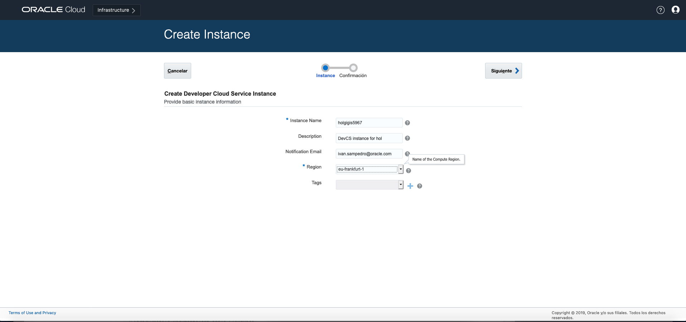

Check the selections in previous screen an click in Create button:

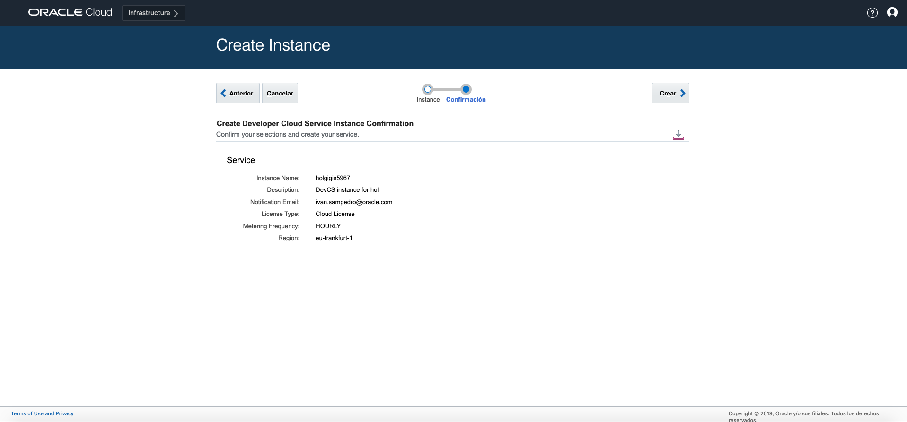

Instance creation starts creating service as you can see in Status screen:

This process will take some time so let’s take advantage of time while this process ends, and we can then configure the Developer Cloud Service Instance.

## **Configuring a Developer Cloud Service Instance**

Now let’s check that Developer Cloud Service has been created so that we can configure it.

Check updated status by clicking in  icon:

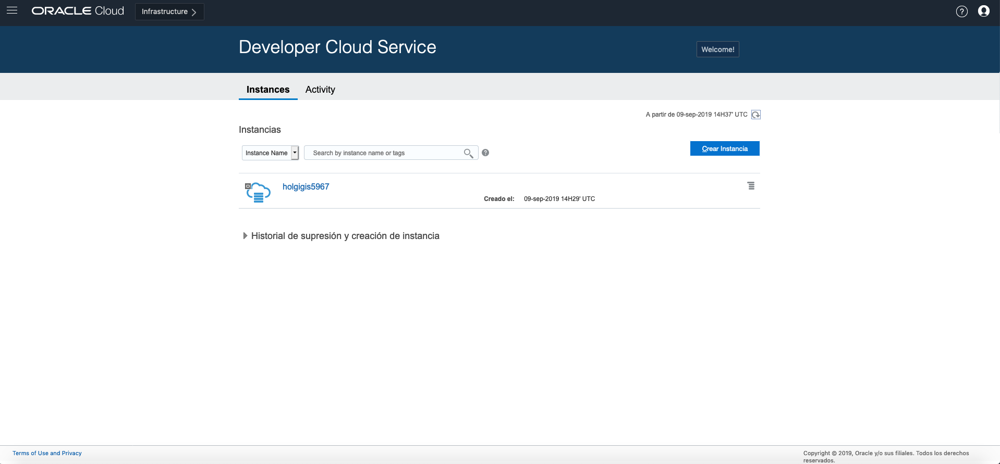

Once the Developer Cloud Service instance has been provisioned, click on the right side menu and select: “Access Service Instance”:

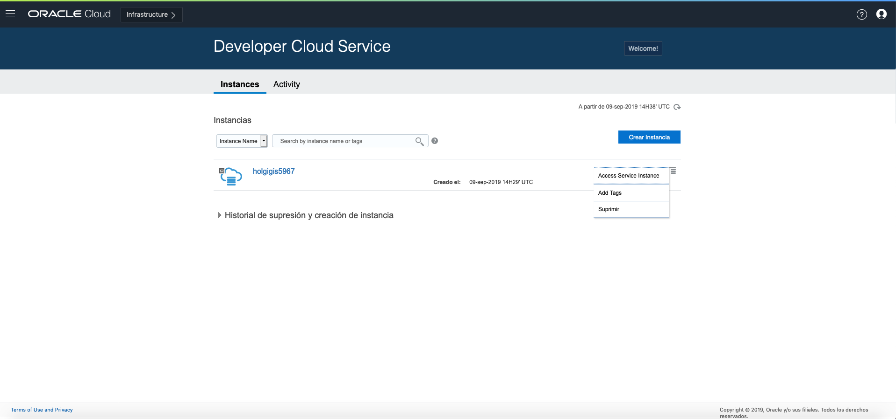

You will see next screen where you are requested to run some extra configurations related with Compute & Storage. Click in OCI Credentials link in Message and have close to you the txt file with OCI information previously gathered:

Select OCI for Account type and fill in the rest of the fields. Leave passphrase blank and also check the box below.

Then click on validate button and if compute and storage connections are correct, then click on Save button.

### Virtual Machines Template configuration in DevCS

Now we need to configure one or two VM servers to be able to build your project developments. We will create a VM Build Server to be used to compile and Build Microservices components and another to compile and Build Fn Function (Serverless) components that will require a different set of Software components:

To do this, we have to create a first virtual Machine Template to be used with Microservices, so click in Virtual Machines Templates tab:

Now click on Create button:

Provide a Name(like VM\_basic\_Template) and select Oracle Linux 7 as Platform:

Now Click in Configure Software button:

Now select the mínimum Software packages will will require later to build our project. If you remember from Introduction section, we will build microservices developed with Node JS v8 and Java . We will also require to access to OCI so OCICli will be required and thus Python will be also needed. Then we will have to build Docker images and also deploy those images in a Kubernetes Cluster thus KUBECtl will be needed too. Finally we also need the Minimum required Build VM components. So mark software components options below:

  - Docker 17.12
  - Kubectl
  - Node.js 8
  - OCIcli
  - Python 3.3.6
  - Required Build VM Components

Click in Done button and we will have finally our VM template created like below:

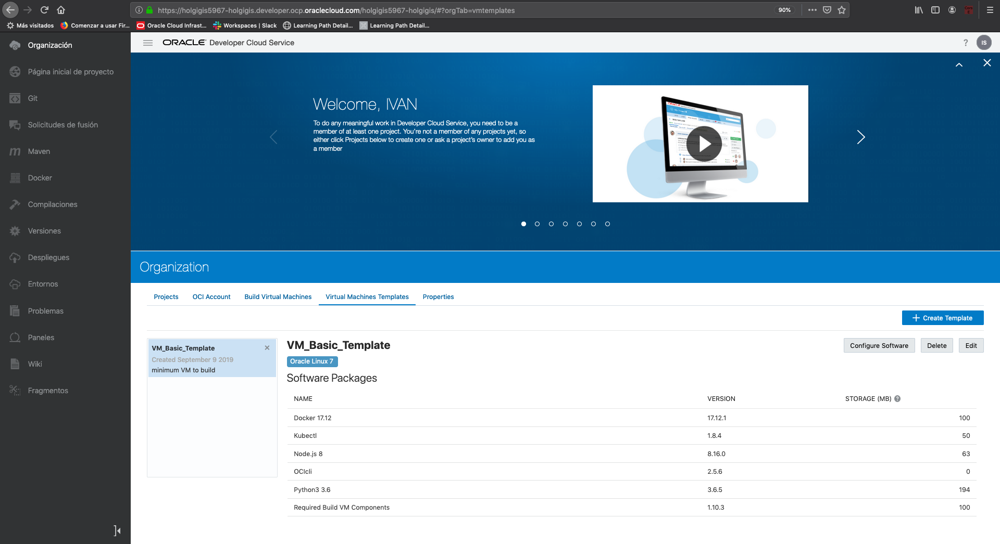

Now we will create a second Virtual Machine Template for Serverless Components. Click in Create Template again and fill in fields and click on Create button:

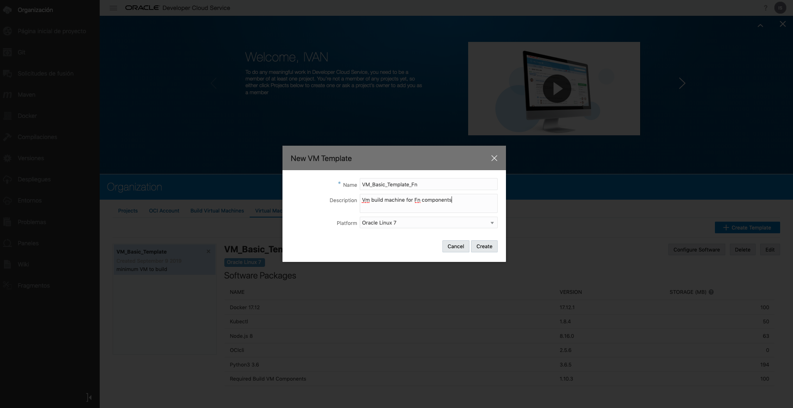

Now we will select specific Software components required for Fn Function build process. Click in Configure Software button:

Now configure software components. Fn 0 will have to be selected together with Docker, OCIcli, Kubectl, Python and required build VM
components. No Node JS and Java components this time required:

Click on Done and these are the software components in VM template:

### Build Virtual Machines configuration in DevCS

Now we have to create a couple of real VM in OCI based in Virtual Machine template just created. So, we will select Build Virtual Machines Tab and will click on Create button:

Now Select 1 as quantity, select the previously created template, your region and finally select as Shape the option VM.Standard.E2.2:

Now your VM will start creation process

It is important to modify to Sleep Timeout a recommend value of300 minutes (basically longer than lab duration) so that once started, the build server won’t automatically enter into sleep mode.

And now we will create following the same process a second Build Virtual machine using the Fn Function defined template:

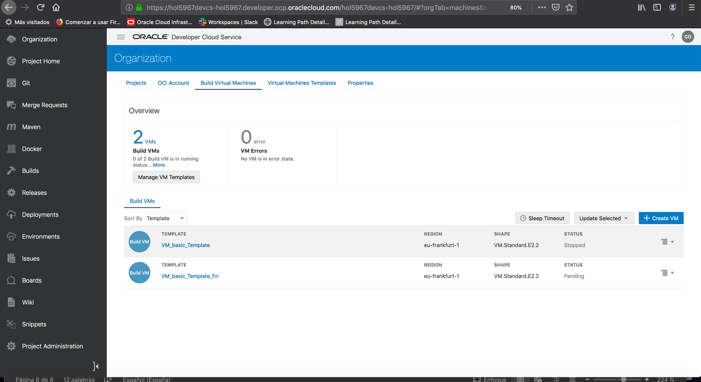

IMPORTANT NOTE: At this point try to manually start both VM Servers like in screenshot below:

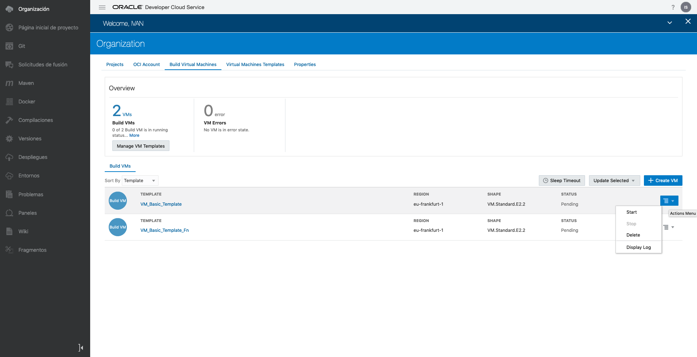

And check that Status changes to starting in both servers:

### Create New Project in DevCS
Now that you have created the environment connection to OCI and Build Machines, you must create a new project. This project will contain all the source code files in the GIT repository and the jobs and pipelines to CI/CD.

To create a new DevCS project click on Project Home menu and then click on +Create Button. Next introduce a representative name (ServerlessHOL for example) and optionally a Project Description. Select Private (Shared if you want your project accesible from external teams) and Preferred Language for the project. Then click Next button.

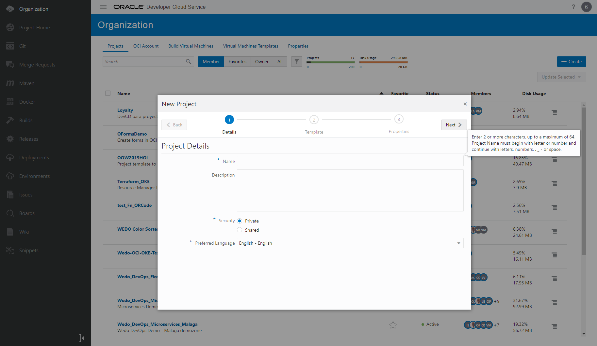

Select Empty Project and Click Next button.

Click Finish to create the new project.

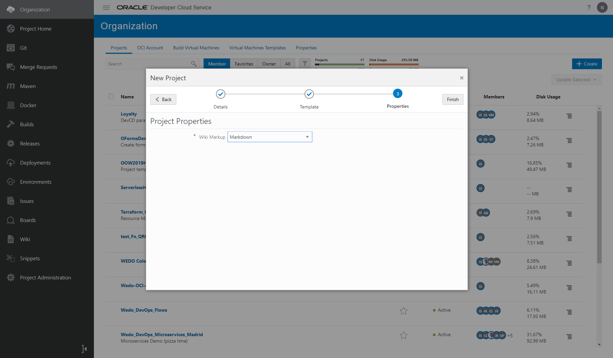

Wait to project environment creation (about 2 or 3 minutes)

### Create GIT Repositories
You have now a new empty project created. Now we are going to create 3 GIT reporsitories, one for each serverless function.
To create a new GIT repo go to Project Home menu and click on Create Repository button. Next you write **fn_pizza_discount_upoload** as GIT name and optionally a Description. Then click Create button.

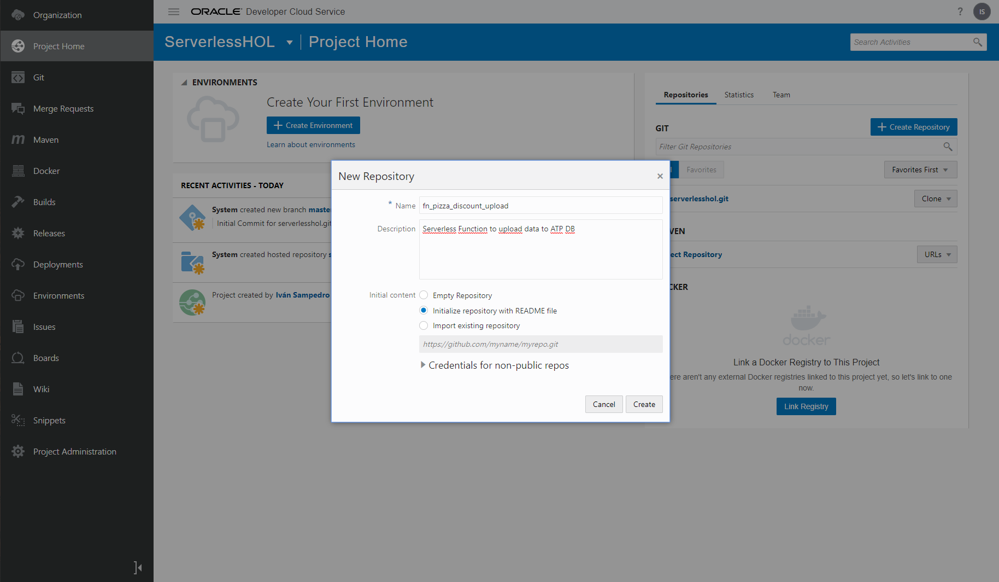

New GIT repo will be created with a README.md file only.

Repeat again to create 2 new GIT repos:
* **fn_pizza_discount_campaign**
* **fn_pizza_discount_cloudevents**

Check that you have three GIT repositories in the main project menu.

