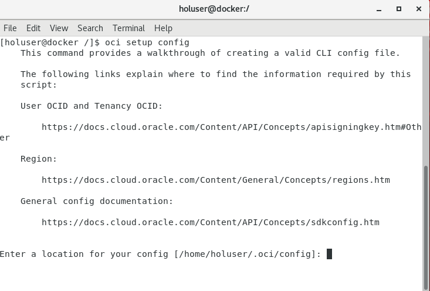
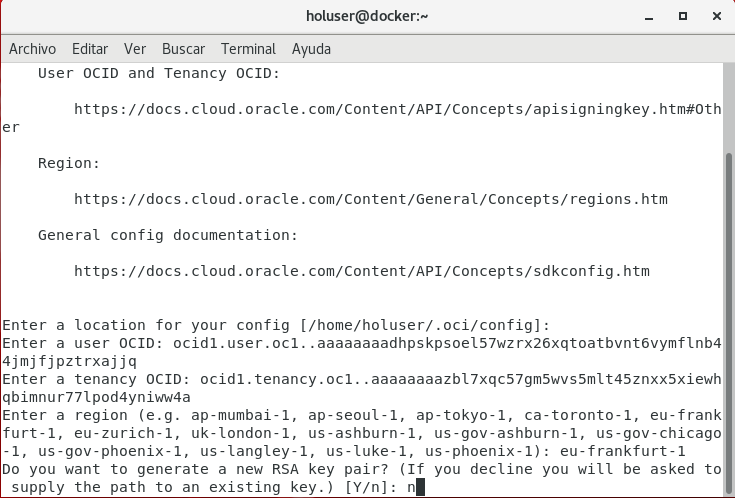

# Create Development Machine
We recomend a linux development machine, but you can use Windows too. 
You can create a Developer Cloud Virtual Machine from Oracle Cloud marketplace also.

If you had you own development machine, please check that you have installed next development resources and applications:

- IDE software
- Java jdk 11
- Docker
- Fn cli
- OCI cli
- OCI user Api Key and Auth Token credentials to access OCIR (Docker Registry)

Make sure you've setup your OCI API signing key and Auth Token (for OCIR access), installed the Fn CLI, completed the CLI configuration steps and have setup the OCI Registry you want to use.

## API signing key and Auth Token
You had created it before, when you was setting up the Developer Cloud Environment. If you didn't create the Api Key and Auth Token credentials you must follow next steps:

[<span class="underline">How to get OCI tenancy config data to configure DevCS</span>](https://github.com/oraclespainpresales/GigisPizzaHOL/blob/master/gigis-serverless-HOL.md#how-to-get-oci-tenancy-config-data-to-configure-devcs)

## Fn Cli Installation
### Linux
```sh
curl -LSs https://raw.githubusercontent.com/fnproject/cli/master/install | sh
```
### Windows
You must download de fn.exe file from fn github public [repository](https://github.com/fnproject/cli/releases)

### OCI cli installation and Configuration
#### Linux
Check that you have installed python3 in you develpment machine. If you don't have python3 installed please install it first.
```sh
sudo yum install python3
```
Then use this command to install OCI cli
```sh
bash -c "$(curl -L https://raw.githubusercontent.com/oracle/oci-cli/master/scripts/install/install.sh)"
```
### Window
Check that you have python3 installed. If you don't have python3 installed please install it [first](https://www.python.org/downloads/)

Follow Next steps:
1. Open the PowerShell console using the **Run as Administrator** option.
2. The installer enables auto-complete by installing and running a script. To allow this script to run, you must enable the RemoteSigned execution policy. To configure the remote execution policy for PowerShell, run the following command.
```sh
Set-ExecutionPolicy RemoteSigned
```
3. To run the installer script, run the following command.
```sh
powershell -NoProfile -ExecutionPolicy Bypass -Command "iex ((New-Object System.Net.WebClient).DownloadString('https://raw.githubusercontent.com/oracle/oci-cli/master/scripts/install/install.ps1'))"
```
### Configuration
If you are upgrading the OCI cli you don't have to configure it again, but if this is your first installation you must execute the configuration command and follow on-screen instructions.
```sh
oci setup config
```


Keep your txt file with your OCI Tenancy parameters close as you will be asked for those parameters. Before starting, please copy into the VM the private key previously provided:





Decline to generate a new RSA key pair, copy your private key previously provided into you environmet machine. We recommend you to paste it into this path:
```sh
/home/holouser/.oci
```

