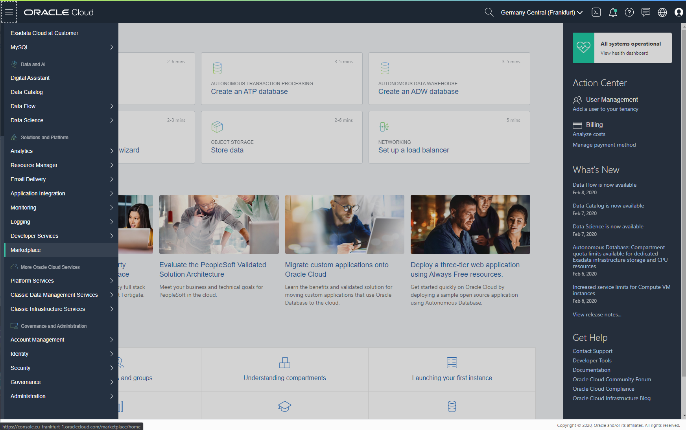

# Create a Development Machine from OCI marketplace.
If you want to create a development machine in your compartment you can choose a predefined development image from OCI marketplace. This development machine will have installed next development software:

**Languages and Oracle Database Connectors**
- Java Platform Standard Edition (Java SE) 8, 11, 12
- GraalVM Enterprise Edition 19
- Python 3.6 and cx_Oracle 7
- Node.js 10 and node-oracledb
- Go 1.12
- Oracle Instant Client 18.5
- Oracle SQLcl 19.1
- Oracle SQL Developer 19.1

**Oracle Cloud Infrastructure Command Line Client Tools**
- Oracle Cloud Infrastructure CLI
- Python, Java, Go and Ruby Oracle Cloud Infrastructure SDKs
- Terraform and Oracle Cloud Infrastructure Terraform Provider
- Oracle Cloud Infrastructure Utilities
- Ansible Modules for Oracle Cloud Infrastructure

**Other**
- Oracle Container Runtime for Docker
- Extra Packages for Enterprise Linux (EPEL) via Yum
- GUI Desktop with access via VNC Server
- Ansible
- .NET Core
- Visual Studio Code
- PowerShell Core
- Rclone
- Eclipse IDE

To create your new development machine from OCI marketplace follow next steps:

Go to OCI main menu Solutions & Platform. Then click Marketplace



##Accessing a Graphical User Interface (GUI) via VNC
To access a GUI via VNC, do the following:

1. Install a VNC viewer on your local computer
2. Use SSH to connect to the compute instance running the Oracle Cloud Developer Image, as described above (connect to the opc user)
3. Configure a VNC password by typing vncpasswd
4. When prompted, enter a new password and verify it
5. Optionally, enter a view only password
6. After the vncpasswd utility exits, start the VNC server by typing vncserver
8. This will start a VNC server with display number 1 for the opc user, and the VNC server will start automatically if your instance is rebooted
9. On your local computer, connect to your instance and create an ssh tunnel for port 5901 (for display number 1): 
```ssh
sh -L 5901:localhost:5901 –i id_rsa opc@<IP Address>
```
10. On your local computer, start a VNC viewer and establish a VNC connection to localhost:1
11. Enter the VNC password you set earlier
