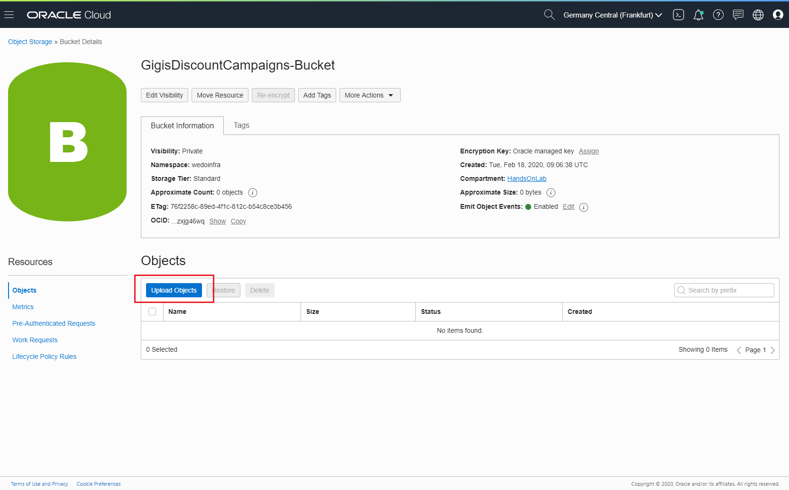
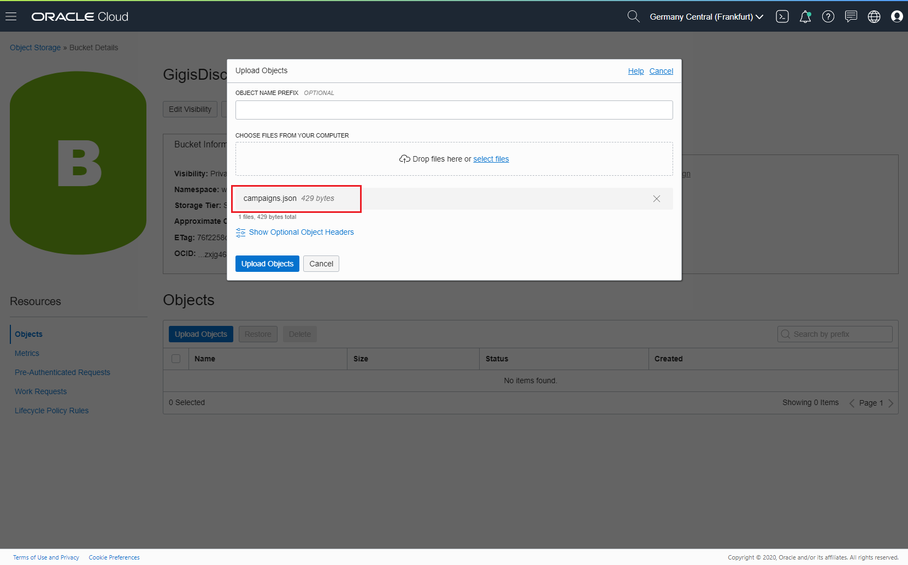
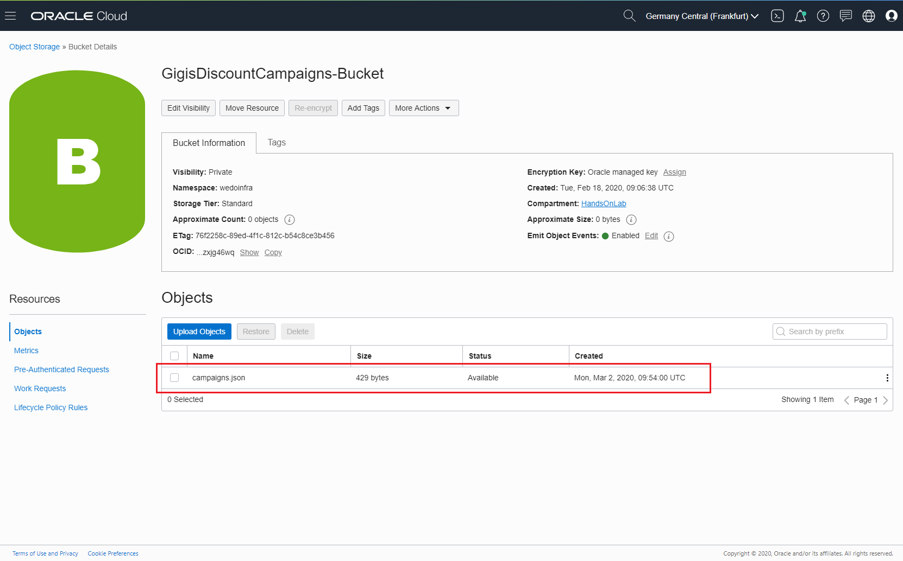

# Serverless Application Execution
Now that you have created and configured all the serverless functions, you will test it.

You test each function step by step to complete the app execution.
First function will be the **cloud event** function. To test this function you have to create a json file with the discount campaigns. This campaign file has next json format:
```json
{
  "campaigns": [
    {
    "demozone": "MADRID",
    "paymentmethod": "VISA",
    "date_bgn": "2020-03-01T00:00:00Z",
    "date_end": "2020-03-05T00:00:00Z",
    "min_amount": "15",
    "discount": "10"
    },
    {
    "demozone": "MADRID",
    "paymentmethod": "AMEX",
    "date_bgn": "2020-03-15T00:00:00Z",
    "date_end": "2020-03-20T00:00:00Z",
    "min_amount": "10",
    "discount": "10"
    }
  ]
}
```
As you can see the file contain a campaign array and each campaign consists of: 
- demozone: a demozone or region to apply the discount (MADRID, MALAGA, TOKYO, MUMBAY, SAN_FRANCISCO...)
- paymentmethod: VISA, MASTERCARD, AMEX, CASH
- date_bgn: inital date for applay the discount
- date_end: final date to apply the discount
- min_amount: the min amount to apply the discount
- discount: % of discount.

Create a campaign file in your favourite text editor (or [atom](https://atom.io/) for example)


Remember that you created an Object Storage bucket in OCI to store campaigns files and you enabled the cloud event check. 


Select your Bucket and check that your are in your right compartment.


Upload the previous created campaigns json file to your bucket. click in Upload Objects button.



Drag and drop your campaign.json file in Drop Files square and check that the file was uploaded. Then Click **Upload Objects** button



A new file should be showed in your bucket.



Next go to your ATP DB Service Console and Development -> SQL Developer Console. You could use the SQL Developer URL

```html
https://<your-ATP-instance>.adb.<your_region>.oraclecloudapps.com/ords/atp/_sdw/?nav=worksheet
```


Introduce your user [MICROSERVICE] and your user password [AAZZ__welcomedevops123]


